# Unit management, streams, and the channel matrix

How a unit is administered on the ROTA server, and how units relate to the
release streams (channels). Companion to [documentation.md](documentation.md)
§7 (channels and version resolution) and §8 (store schema); this page focuses
on the mental model.

## How a unit is managed

A unit exists in exactly one place: as a record in `devices.json` on the VPS
(schema reference: [devices.example.json](../examples/devices.example.json)),
keyed by its 12-hex MAC identifier. The record has two kinds of fields:

| Field | Owner | Meaning |
|---|---|---|
| `secret` | operator | Per-unit HMAC key; must match the `ota_secret` flashed on the device. Used by `rota_authenticate()` in `public/lib/rota_lib.php`. |
| `unit_type` | operator | Hardware/product type, e.g. `ghc1`. Selects the *column* in the channel matrix. |
| `channel` | operator | `soak` or `mainstream`. Selects the *row*. Absent ⇒ defaults to `mainstream`. |
| `pinned_version` | operator | A version string, or `null`. When set, overrides the channel entirely. |
| `enabled` | operator | `false` makes authentication fail silently (HTTP 204). |
| `last_seen` | server | Telemetry, written on every check-in. |
| `fw_ver` | server | Version the unit last reported running. |

All management is editing that file:

- **Add a unit** — new record keyed by the MAC, plus the same `secret` (and
  server URL) provisioned on the device.
- **Assign / change stream** — set `"channel": "soak"` or `"mainstream"`.
- **Hold at a known-good release** — set `pinned_version`; set it back to
  `null` to resume following the channel.
- **Disable** — `"enabled": false`.

Changes take effect on the unit's next check-in. A key design point: the
device knows only its id, secret, and server URL. It does **not** know its
channel, unit type, or pin — those exist only in the server registry, so a
unit can never choose or report its own stream.

## Where releases come from

GitHub Releases feed the store, but indirectly. A cron job on the VPS
([ota-store-update.sh](../tools/ota-store-update.sh)) polls the public
firmware repo, and for any release carrying a `manifest-*.json` asset it
downloads the firmware binary and web-assets archive, verifies sha256 and
size against the manifest, and stages everything atomically into
`releases/<version>/`. It then moves the **soak** pointer for that unit type
automatically (guarded by the monotonic `seq` so it never downgrades). The
**mainstream** pointer is never touched by automation — only the manual
`rota_release.py promote` step moves it, after a human is satisfied with the
soak run.

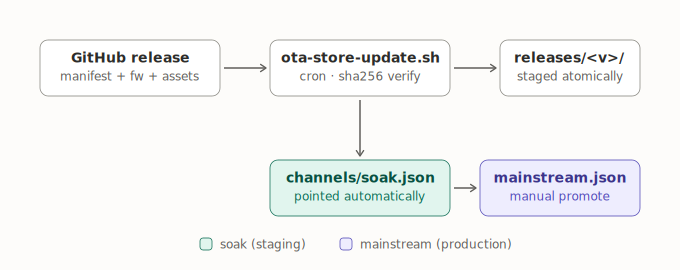

## The channel matrix — streams × unit types

It is tempting to picture a matrix with units on the rows and versions on the
columns. The actual matrix is smaller and sits one level of indirection away
from both:

- **Rows are the streams** — one file per stream: `channels/soak.json` and
  `channels/mainstream.json`.
- **Columns are unit types** — each channel file is keyed by `unit_type`
  (currently just `ghc1`).
- **Each cell holds a single version pointer**, not a set of versions.

Units are *not in* the matrix: each unit's `(channel, unit_type)` pair selects
one cell, and any number of units can share the same cell. Versions are not an
axis either: they live as a pool under `releases/<version>/`, and the cells
point into that pool.

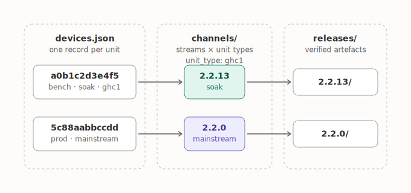

As a table, the matrix currently looks like this (versions illustrative):

|  | `ghc1` | *(future unit type)* |
|---|---|---|
| **soak** | 2.2.13 | — |
| **mainstream** | 2.2.0 | — |

## What happens at check-in

When a unit calls `manifest.php`, the offered version resolves as:

```
offer =  devices.json[id].pinned_version                    if set and valid
         else  channels/<channel>.json[unit_type].version   (channel defaults to "mainstream")
```

If neither resolves, the unit gets `404 no_release`. On success the server
returns the stored release manifest verbatim — the **client** compares it to
its running version and decides whether to update.

One nuance the diagram simplifies: the production unit `5c88…` is on
`mainstream` *and* pinned to `2.2.0`. While the pin is set, the mainstream
cell is ignored entirely — the pin is a per-unit escape hatch that bypasses
the matrix, which is why production only moves when the operator deliberately
unpins or re-pins it.

## Use-case catalogue

Every management operation in the system, grouped by which part of the store
it touches. (Full step-by-step procedures live in
[documentation.md](documentation.md) §11; the exact commands and worked
examples for every use case are in [cliManual.md](cliManual.md).)

### Unit use cases (edits to `devices.json`)

| # | Use case | Rationale |
|---|---|---|
| 1 | **Add a unit** | Create a record keyed by the MAC; provision the same `secret` + URL on the device. A unit does not exist until the server knows it — unknown ids get a silent 204. |
| 2 | **Remove a unit (hard)** | Delete the record, set `ota_enable=0` on the device if reachable, retire its secret. For decommissioned or compromised hardware. |
| 3 | **Enable / disable a unit (soft stop)** | `"enabled": false` instantly stops updates *and* telemetry without losing the record; reversible. Enable/disable applies to **units**, not versions. |
| 4 | **Assign a unit to a stream** | `"channel": "soak"` or `"mainstream"` — decides which row of the matrix the unit reads. |
| 5 | **Pin a unit to a version** | `pinned_version` overrides the stream entirely. Holds production at a known-good release regardless of what mainstream points to. |
| 6 | **Unpin a unit** | Set `pinned_version` back to `null`; the unit resumes following its stream. The deliberate act that lets production move again. |

### Version-pool use cases (`releases/`)

| # | Use case | Rationale |
|---|---|---|
| 7 | **Add a version to the pool** | Publish a GitHub Release with a manifest asset — the retriever verifies and stages it (or `rota_release.py publish` pushes it directly). Nothing else in the system works without it. |
| 8 | **Remove a version from the pool** | Mostly automatic: `prune-releases.sh` keeps the newest `ROTA_KEEP` (default 5) and never prunes a version any stream or pin references. Recoverable by re-publishing from the firmware repo's master copies. |

> **Not a use case: enable/disable a version.** Versions have no on/off
> state. A version is "active" purely by being pointed at — by a stream cell
> or a pin. The nearest real things are: a *pre-release* is staged without
> soak being pointed at it, and a fully unreferenced version sits inert until
> pruned.

### Stream use cases (`channels/*.json`)

"Assign a version to a stream" is really three distinct operations, because
*who* moves the pointer differs:

| # | Use case | Rationale |
|---|---|---|
| 9 | **Point soak** | Done automatically by the retriever on each new full release (monotonic `seq` guard, never downgrades). Not an operator action in normal operation. |
| 10 | **Promote to mainstream** | `rota_release.py promote <version>`, always manual. The human gate between staging and production is the core safety property of the two-stream design. |
| 11 | **Force / roll back a stream** | Hand-edit the channel file to point at an older staged version. The automation deliberately refuses to downgrade, so rollback must be an explicit human decision (pinning is the per-unit alternative). |

### Observation (no state change)

| # | Use case | Rationale |
|---|---|---|
| 12 | **Inspect state** | `rota_release.py status` for what each stream offers; `last_seen` / `fw_ver`, `checkins.csv`, and `/var/log/rota-device.log` for whether units check in and what they run. How you verify every use case above actually took effect, since changes only land on a unit's next check-in. |

One use case exists only implicitly: **adding a new unit type** (a new column
in the matrix). It is not a separate procedure — it emerges from publishing a
manifest with a new `unit_type` plus registering units with that type — but
worth knowing it is there when a second product appears.

## Use-case diagrams

One PlantUML use-case diagram per catalogue entry. The PNGs are rendered from
the `.puml` sources next to them in [images/](images/); regenerate with
`plantuml -tpng images/*.puml`. Recurring actors: the **Operator** (the human
managing the fleet), the **Unit** (a greenhouse controller checking in over
HTTPS), the **Retriever** (the `ota-store-update.sh` cron job), and **GitHub**
(the external releases API). The system boundary in every diagram is the ROTA
server with its `ota-store/`.

### UC1 — Add a unit

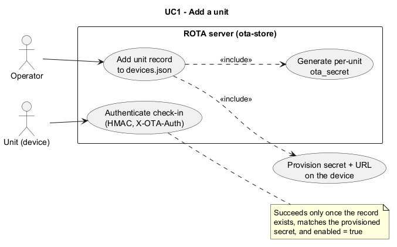

*Source: [uc01-add-unit.puml](images/uc01-add-unit.puml)*

The Operator performs *Add unit record to devices.json*, which by definition
includes two sub-steps: generating a fresh per-unit `ota_secret`, and
provisioning that same secret plus the server URL onto the physical device —
the provisioning step is drawn outside the system boundary because it happens
on the device, not on the server. The Unit is the second actor: its
*Authenticate check-in* use case is only satisfiable after this registration
completes, which the attached note makes explicit — the HMAC in `X-OTA-Auth`
must be computed with the provisioned secret, the id must exist in the
registry, and `enabled` must be true. Postcondition: the unit is a managed
member of the fleet and starts producing telemetry on its first check-in.

### UC2 — Remove a unit (hard)

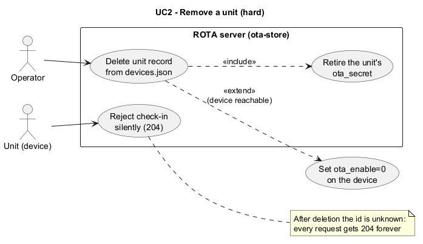

*Source: [uc02-remove-unit.puml](images/uc02-remove-unit.puml)*

The Operator performs *Delete unit record from devices.json*, which includes
retiring the unit's `ota_secret` in the private secret store so it can never
be reused. The extend relationship to *Set ota_enable=0 on the device* is
conditional — it only applies when the device is still reachable (a stolen or
dead unit is not), which is why it is an extension rather than an inclusion.
The Unit actor is still shown attempting *Reject check-in silently (204)*:
after deletion its id is simply unknown, so the server drops every request
with the reserved 204 forever, indistinguishable from a non-existent server.
This is the irreversible variant of UC3; use it for decommissioned or
compromised hardware.

### UC3 — Enable / disable a unit (soft stop)

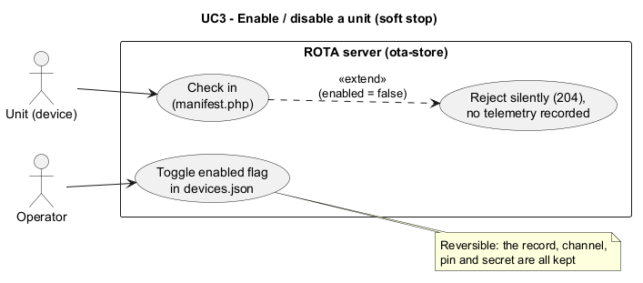

*Source: [uc03-enable-disable-unit.puml](images/uc03-enable-disable-unit.puml)*

The Operator performs *Toggle enabled flag in devices.json*. The Unit
continues its normal *Check in* use case, but when `enabled` is false the
check-in is extended by *Reject silently (204), no telemetry recorded* — the
extend arrow carries the condition. The note stresses what distinguishes this
from UC2: the record, channel assignment, pin, and secret are all preserved,
so flipping the flag back restores the unit exactly as it was. This is the
tool for temporarily freezing a misbehaving unit, or for pre-staging a record
before the hardware is deployed.

### UC4 — Assign a unit to a stream

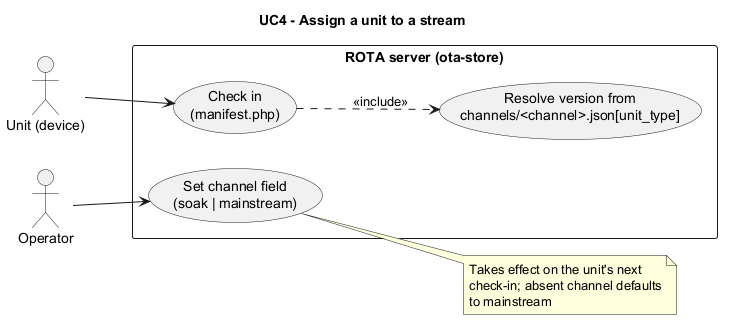

*Source: [uc04-assign-stream.puml](images/uc04-assign-stream.puml)*

The Operator performs *Set channel field* to either `soak` or `mainstream` —
this selects the *row* of the channel matrix the unit will read. The Unit's
*Check in* use case includes *Resolve version from
`channels/<channel>.json[unit_type]`*: the server, not the device, combines
the channel (row) with the unit's `unit_type` (column) to find the offered
version. The note captures the two operational subtleties: the change only
lands on the unit's next check-in (there is no push path), and a record
without a `channel` field defaults to `mainstream`, the safe choice.

### UC5 — Pin a unit to a version

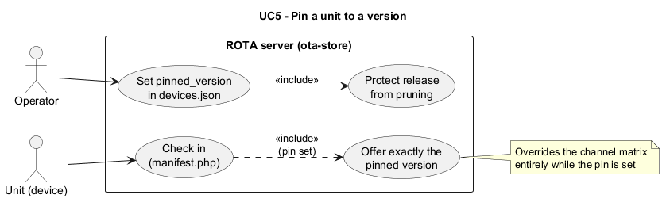

*Source: [uc05-pin-unit.puml](images/uc05-pin-unit.puml)*

The Operator performs *Set pinned_version in devices.json*. Two things follow.
First, the Unit's *Check in* is extended-by-condition to *Offer exactly the
pinned version* — while the pin is set, the channel matrix is not consulted at
all, which the note makes explicit. Second, the pin includes *Protect release
from pruning*: `prune-releases.sh` never removes a version that any unit's
`pinned_version` names, so pinning production to an old release automatically
keeps that release on the server. This is how the production unit `5c88…` is
held at a known-good version regardless of what happens to mainstream.

### UC6 — Unpin a unit

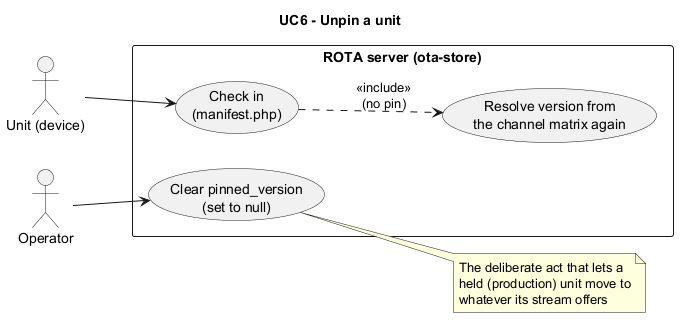

*Source: [uc06-unpin-unit.puml](images/uc06-unpin-unit.puml)*

The mirror image of UC5: the Operator performs *Clear pinned_version (set to
null)*, and from the next check-in onward the Unit's *Check in* again includes
*Resolve version from the channel matrix*. The diagram exists separately from
UC5 because unpinning is the deliberate, auditable act that allows a held
production unit to move — typically executed together with UC10 (promote)
when a soaked release is ready for the field, after which the operator
usually re-pins to the new version.

### UC7 — Add a version to the pool

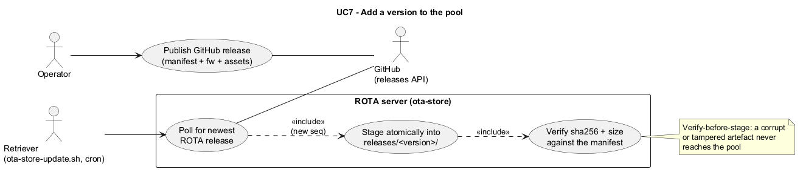

*Source: [uc07-add-version.puml](images/uc07-add-version.puml)*

The only use case with three actors. The Operator performs *Publish GitHub
release* (on GitHub, outside the system boundary) containing the three
artefacts: `manifest-<v>.json`, the firmware binary, and the web-assets
archive. Independently, the cron-driven Retriever performs *Poll for newest
ROTA release* against the GitHub releases API — the pull direction is the
point: no GitHub workflow holds a key that can write to the VPS. When a new
`seq` appears, polling includes *Stage atomically into `releases/<version>/`*,
which itself includes *Verify sha256 + size against the manifest* — the
verify-before-stage ordering in the note guarantees a corrupt or tampered
download never becomes servable. Postcondition: the version exists in the
pool; whether anything is *offered* it is decided by UC9/UC10.

### UC8 — Remove a version from the pool

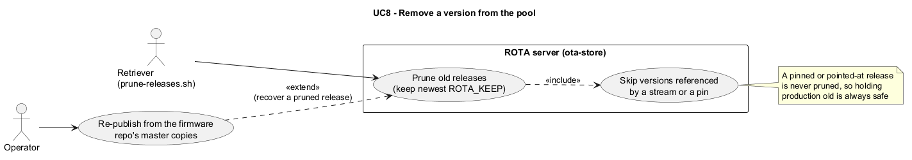

*Source: [uc08-remove-version.puml](images/uc08-remove-version.puml)*

Primarily an automated use case: the Retriever (via `prune-releases.sh`, run
after every pull) performs *Prune old releases*, keeping the newest
`ROTA_KEEP` (default 5). The included *Skip versions referenced by a stream
or a pin* is the safety property — a release that `soak`, `mainstream`, or
any unit's `pinned_version` names is never deleted, so retention can never
strand a unit. The Operator appears on the recovery path: *Re-publish from
the firmware repo's master copies* extends the use case for the rare moment a
pruned release is needed again, since `bin/<version>/` in the firmware repo
remains the master copy of every release ever made.

### UC9 — Point soak (automatic)

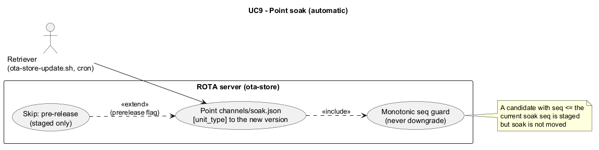

*Source: [uc09-point-soak.puml](images/uc09-point-soak.puml)*

No human in this diagram: the Retriever performs *Point
`channels/soak.json[unit_type]`* immediately after staging a new full release
(UC7). The included *Monotonic seq guard* is what makes the automation safe —
a candidate whose manifest `seq` is not strictly greater than the current
soak release's `seq` is staged but the pointer is not moved, so the
automation can never downgrade the staging stream. The extend from *Skip:
pre-release* covers the `--stage-prereleases` mode: a GitHub pre-release is
downloaded and verified into the pool, but soak is deliberately left alone
until a full release is cut.

### UC10 — Promote to mainstream (manual)

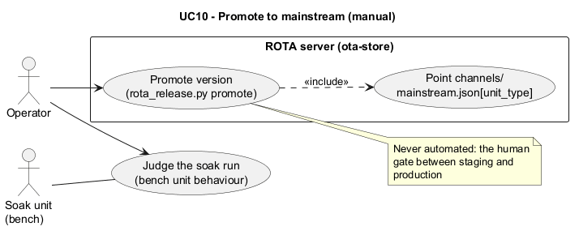

*Source: [uc10-promote-mainstream.puml](images/uc10-promote-mainstream.puml)*

The human gate of the whole design. The Operator first performs *Judge the
soak run* — an off-server activity in which the bench unit (shown as the
second actor) is the evidence: it has been pulling and running the soak
release since UC9. Only when satisfied does the Operator perform *Promote
version* via `rota_release.py promote <version>`, which includes *Point
`channels/mainstream.json[unit_type]`*. The note states the invariant: no
automation ever touches mainstream. Production units on the `mainstream`
stream pick the new version up on their next check-in — unless they are
pinned (UC5), in which case UC6 is also required.

### UC11 — Force / roll back a stream

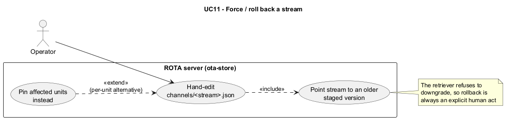

*Source: [uc11-rollback-stream.puml](images/uc11-rollback-stream.puml)*

The escape hatch. The Operator performs *Hand-edit `channels/<stream>.json`*,
which includes *Point stream to an older staged version* — legitimate
precisely because the retriever's no-downgrade guard (UC9) refuses to do this
automatically; going backwards must be an explicit human decision. The extend
to *Pin affected units instead* records the alternative strategy: when only
some units need to retreat, per-unit pins (UC5) are surgical, while editing
the channel file moves every unpinned unit on that stream at once. The target
version must still exist in the pool, which UC8's reference protection
guarantees for anything currently pointed at.

### UC12 — Inspect state (observation)

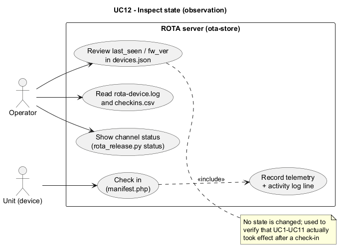

*Source: [uc12-inspect-state.puml](images/uc12-inspect-state.puml)*

The only use case that changes nothing. The Operator has three read paths:
*Show channel status* (`rota_release.py status` — what each stream currently
offers per unit type), *Review `last_seen` / `fw_ver`* in the registry (what
each unit last reported running, and when), and *Read `rota-device.log` and
`checkins.csv`* (the per-request activity trail, including which version was
offered on each check-in). The Unit feeds all of this: its *Check in*
includes *Record telemetry + activity log line*, so observation data is a
by-product of normal operation. As the note says, this is how every other use
case is verified — since changes only take effect on a unit's next check-in,
UC12 is the confirmation step that closes the loop on UC1–UC11.
